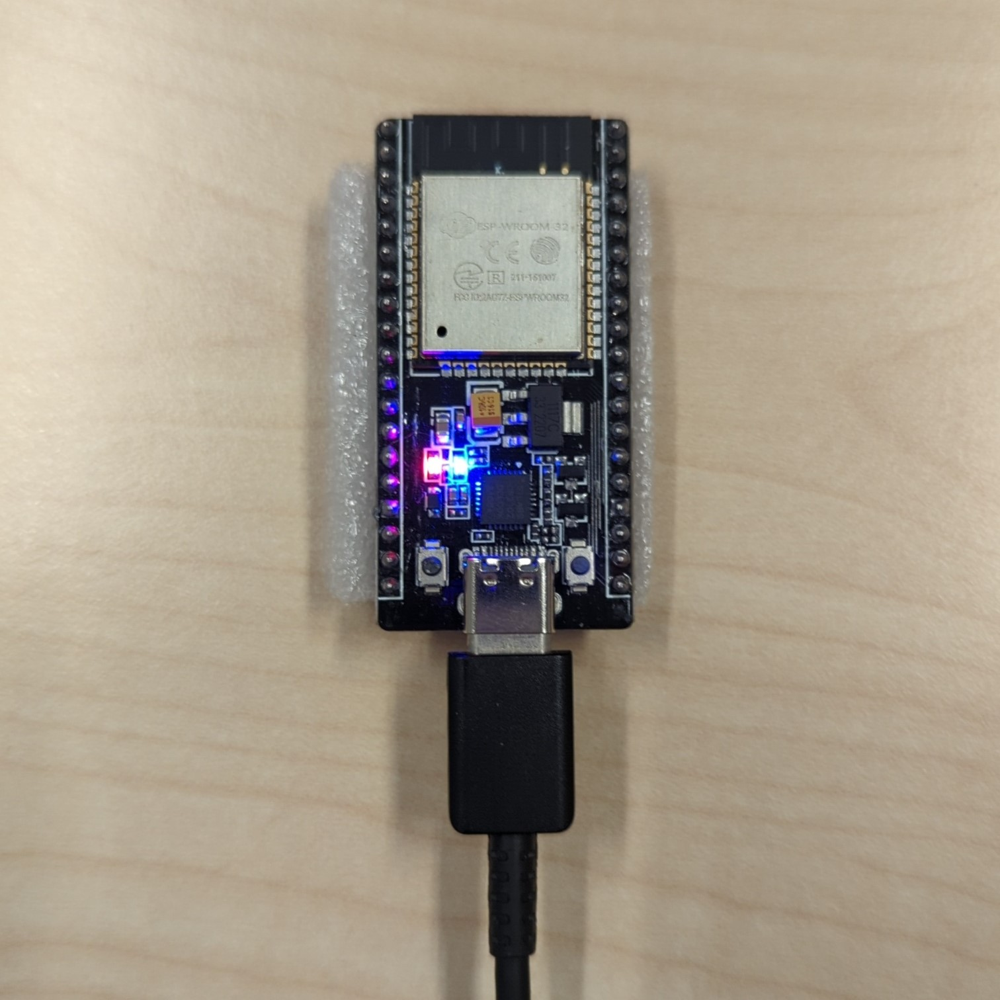
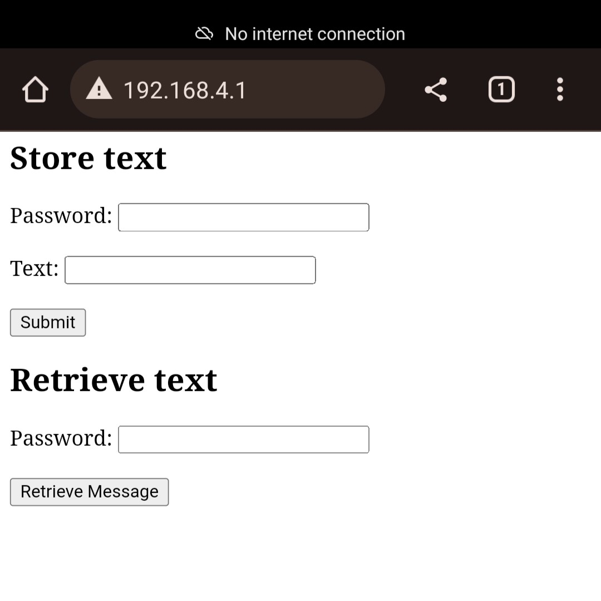

# IoT Worksheet 3 documentation

## Ahmed Sharuvan [22023493]

Personal information security can sometimes be hard to achieve given how connected our personal computers are nowadays with potential threat actors able to connect to our devices over the internet. This project proposes the use of microcontroller modules to securely store critical information of value that should rather be kept offline and isolated from personal computers.

## Architecture
Wireless Safe is an IoT demonstration program implemented on an ESP32 module using its WiFi and storage capability. The device hosts a lightweight web server to provide a web interface to give access to two operations: store and retrieve. Each of the operations requires a preconfigured password. Store operation uses a simple cipher on the input text and stores it in the EEPROM so that power interruptions will not erase the valuable data. The retrieve operation will fetch the contents, decipher and display. To provide offline access to the web server, it hosts a secured WiFi access point to connect with the server.

## Example use case
In cryptocurrency, a cold wallet is a generated key that is used infrequently and to hold large amounts in value. Such a key can be a 32 byte string even though it is of critical value. A Bitcoin key is stored in the "Wireless Safe" device and retrieved using the password.

## How to build
- Open wirelessSafe project directory in Arduino IDE.
- Install esp32 board in Arduino board manager.
- Configure constants in file wirelessSafe.ino.
- Connect an ESP32 device.
- Click upload.

## How it works
- Connect to its WiFi access point "Wireless Safe" with the preconfigured password.
- Go to address 192.168.4.1.
- Fill out a form corresponding to an operation and click on the submit button.